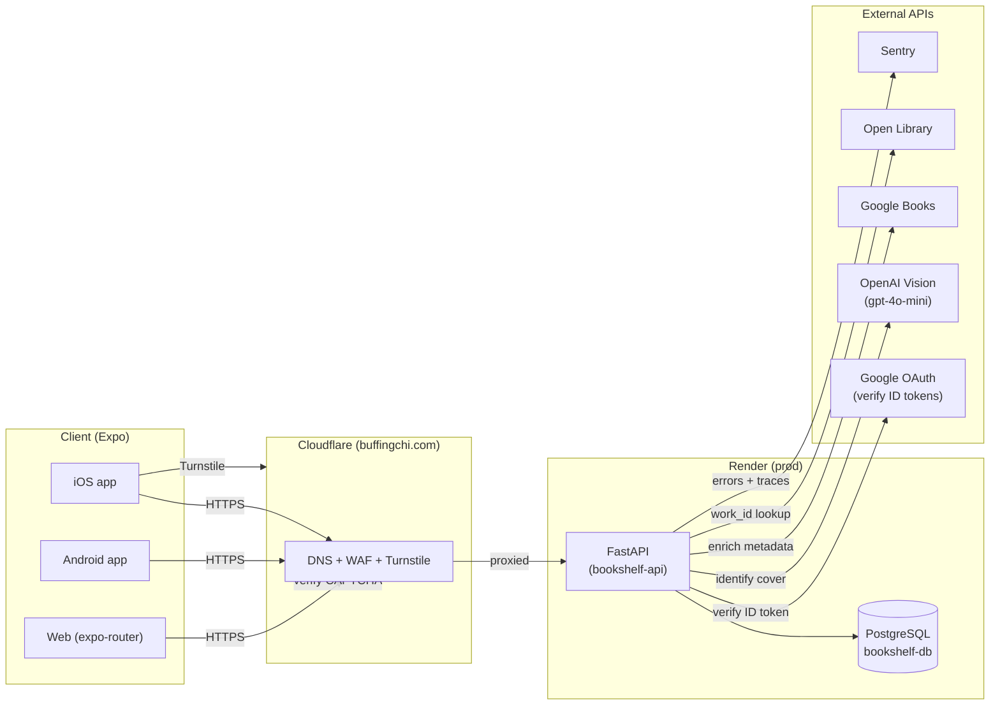

# Architecture

High-level system design, request lifecycle, middleware ordering, and the architectural decisions behind Bookshelf. For user-facing flows (scan, auth, reading states) see [`features.md`](features.md). For the REST endpoint reference see [`api.md`](api.md).

## System diagram

**Components:**
- **Frontend** (Expo SDK 55): one TypeScript codebase ships native iOS, native Android, and web. Runs on Hermes JS engine on native. Uses `expo-router` for file-based navigation.
- **Cloudflare**: DNS + WAF + Turnstile for `bookshelfapi.buffingchi.com`. Bot Fight Mode is on; health-check CI bypasses this entirely by hitting the Render origin directly (see [ADR: CI health checks bypass Cloudflare](#adr-ci-health-checks-bypass-cloudflare)).
- **Backend** (FastAPI on Render): Python 3.12, async end-to-end (SQLAlchemy async sessions, httpx for outbound). Auto-deploys from `dev` per `render.yaml`.
- **Database**: PostgreSQL 15 on Render, connection string injected as `DATABASE_URL`.
- **External APIs**: called server-side only from the FastAPI backend — the frontend never holds OpenAI or Google Books keys.

## Request lifecycle

A typical authenticated request (`POST /user-books/purchased`):

1. Client sends HTTPS with `Authorization: Bearer <access-token>`.
2. Cloudflare terminates TLS, runs WAF + Bot Fight Mode, forwards to Render.
3. Render's edge reaches the FastAPI app on the service port.
4. Middleware stack runs outermost → innermost (see next section).
5. Router matches the path → endpoint function runs. FastAPI dependencies inject the DB session + authenticated `current_user` (via `app/auth/dependencies.py`).
6. Endpoint mutates the DB via `SQLAlchemy` async session → commits.
7. Response flows back through the middleware stack (security headers added on the way out).
8. Client receives the JSON response with `X-Request-ID` and security headers set.

## Middleware stack

Middleware is configured in `backend/app/main.py`. FastAPI's `add_middleware` wraps in **reverse order** — the last call added is the outermost layer (first to see the request, last to touch the response).

| Order (outermost first) | Middleware | Role | Active in |
|---|---|---|---|
| 1 | `_HealthExemptTrustedHost` | Drops spoofed Host headers; exempts `/health` so CI probes bypassing Cloudflare can still hit the origin | prod only |
| 2 | `RequestSizeLimitMiddleware` | Rejects Content-Length > 10 MB with 413 before reading the body | all envs |
| 3 | `CORSMiddleware` | Allowlisted origins only (validator blocks `*`); credentials allowed; limited methods + headers | all envs |
| 4 | `CloudflareRealIPMiddleware` | Sets `request.scope["client"]` from `CF-Connecting-IP` so slowapi rate-limits per real client, not per Cloudflare edge IP | prod only |
| 5 | `RequestIdMiddleware` | Generates a request ID, stores it in a contextvar for log correlation, returns it as `X-Request-ID` | all envs |
| 6 | `SentryContextMiddleware` | Attaches request context to Sentry events | all envs |
| 7 | `SecurityHeadersMiddleware` | Sets `X-Frame-Options`, `X-Content-Type-Options`, `Referrer-Policy`, `CSP`, `Permissions-Policy`, and (prod only) `HSTS` on every response | all envs |

**Why this ordering:**
- `_HealthExemptTrustedHost` is outermost so spoofed Host headers are rejected **before any middleware runs** — minimizes attack surface. `/health` is exempt because health probes (CI, Render's own, uptime monitors) hit the origin by its infrastructure hostname, not the public domain.
- `RequestSizeLimit` runs before CORS so oversized bodies are dropped without allocating request memory.
- `CloudflareRealIP` must run **before** slowapi inspects the client IP — otherwise rate limits key on Cloudflare's edge IP and every unauthenticated user shares the same bucket.
- `RequestId` runs before `SentryContext` so the request ID is available to attach to Sentry events.
- `SecurityHeaders` is innermost on the request (outermost on the response) because it only touches responses.

## Auth architecture

**Identity:** Google OAuth 2.0. The backend trusts any of three configured client IDs (`google_client_id` / `google_ios_client_id` / `google_android_client_id`) so the same API can serve web, iOS, and Android apps. `app/auth/google.py` verifies the Google ID token against Google's JWKS.

**Session tokens:** JWT RS256 (asymmetric).
- **Access token** (`type: access`, 24h default via `jwt_expiry_hours`): short-lived, sent as `Authorization: Bearer` on every authenticated request.
- **Refresh token** (`type: refresh`, 7d default via `refresh_token_expiry_days`): carries a `jti` claim. The `jti` is persisted in the `refresh_tokens` table at issuance time and checked on every `/auth/refresh` call.

**Why RS256 (not HS256):** the public key can be exposed freely (and is, if we ever need to verify tokens in a second service) while the signing key stays on the API. HS256 would require sharing the symmetric secret anywhere verification happens.

**Refresh rotation + revocation:**
- `/auth/refresh` validates the incoming refresh JWT, checks the `jti` exists and is not revoked in the DB, issues a new access + refresh pair, and **marks the old `jti` as revoked**.
- `/auth/logout` revokes the presented refresh `jti`.
- This means a stolen refresh token is one-use: the moment the legitimate client refreshes, the attacker's copy is revoked.

**Single-user lockdown:** `ALLOWED_EMAILS` (comma-separated env var) is the allowlist. Any authenticated email not in that list is rejected at the `/auth/google` exchange. Makes sense for a personal app; remove the check to open the API to arbitrary Google accounts.

## Rate limiting

Backed by `slowapi` + in-memory storage (single Render instance). Every endpoint carries a `@limiter.limit(settings.rate_limit_*)` decorator — this is rule #8 in `CLAUDE.md`. Defaults (per-client):

| Bucket | Default | Applied to |
|---|---|---|
| `rate_limit_auth` | 5/min | `/auth/*` endpoints |
| `rate_limit_scan` | 10/min | `POST /scan` |
| `rate_limit_books_search` | 30/min | `GET /books/search` |
| `rate_limit_writes` | 60/min | POST/PATCH/DELETE on `/user-books/*` |
| `rate_limit_reads` | 120/min | GET on `/user-books/*`, `/auth/me` |
| `rate_limit_health` | 60/min | `/health` |

**Keying:** by client IP, restored from `CF-Connecting-IP` in production (see `CloudflareRealIPMiddleware` above). Without this restoration every client would share Cloudflare's edge IP and the limits would be useless.

A 429 response is logged at WARN level with the offending path, so repeated hits surface in Sentry.

## Book identification + dedup pipeline

Lives in `backend/app/services/` and is orchestrated from the `POST /scan` endpoint.

1. **`ChatGPTVisionIdentifier`** (`chatgpt_vision.py`) — base64-encodes the uploaded image, sends it to `gpt-4o-mini` with a structured-output prompt asking for `{title, author, confidence, isbn}`. 15-second timeout, 512 max tokens. Returns top 3 candidates with confidence scores.
2. **`EnrichmentService`** (`enrichment.py`) — for each candidate, tries Google Books first (title+author query), falls back to Open Library. Populates `open_library_work_id`, `google_books_id`, cover URL, description, ISBN.
3. **`DeduplicationService`** (`deduplication.py`) — checks the user's existing library. Keyed on `open_library_work_id` (primary) or `google_books_id` (fallback). Any candidate already in the user's library is flagged `already_in_library=True` but still returned — the frontend chooses to warn or skip.
4. Response is up to 3 `EnrichedBook` objects; the frontend's `BookCandidatePicker` shows them and the user confirms one.

**Why work_id-based dedup instead of ISBN:**
- A single "work" (e.g. *Dune*) has dozens of editions — hardcovers, paperbacks, audiobooks, translations, anniversary reprints — all with different ISBNs. ISBN-based dedup would let the user wishlist 14 copies of *Dune*.
- Open Library's `work_id` identifies the conceptual book independent of edition, which matches how users actually think about their collection.
- When the work_id is unavailable, we fall back to Google Books volume ID (which is also work-level, not edition-level).

## Architectural decision records

### ADR: JWT RS256 over HS256
**Decision:** asymmetric signing for access + refresh tokens.
**Reasoning:** the public key can be distributed without risk, so any future verifier (a worker, a second service, a downstream proxy) doesn't need the signing secret. Zero cost today, big optionality later.

### ADR: Refresh token rotation with server-side JTI revocation
**Decision:** every `/auth/refresh` issues a new refresh token and revokes the old `jti` in the `refresh_tokens` table.
**Reasoning:** makes refresh tokens **effectively single-use**. A stolen refresh token is invalidated the moment the legitimate client refreshes. Trade-off: any refresh-token race on the client (two parallel tabs, interrupted network) can log the user out; acceptable for this app's usage pattern.

### ADR: Work-level book deduplication (Open Library `work_id`)
**Decision:** dedup by `open_library_work_id`, not ISBN.
**Reasoning:** users think in terms of the work (*Dune*), not the edition. ISBN-based dedup would break the mental model — 14 copies of *Dune* isn't a collection, it's noise.

### ADR: CI health checks bypass Cloudflare
**Decision:** backend-health CI job hits `bookshelf-api-rxp3.onrender.com` directly, not the public `bookshelfapi.buffingchi.com`. `/health` is exempt from `TrustedHostMiddleware` via `_HealthExemptTrustedHost`.
**Reasoning:** Cloudflare's Bot Fight Mode 403s GitHub Actions runner IPs (Azure cloud ranges) before WAF custom rules fire, and free-tier Bot Fight Mode is not skippable via custom rules. The direct-origin probe tests whether Render is up, which is the actual signal we care about. See `docs/claude/` and wcmchenry3-stack/.github#45 for the full diagnostic walkthrough.

### ADR: In-memory rate limiting (single instance)
**Decision:** `slowapi` with in-memory storage, no Redis.
**Reasoning:** Render runs a single instance (starter plan) so there's no distributed coordination problem. When we scale to multiple instances we'll need Redis-backed storage — but today it would be over-engineering. Documented here so the cost of scaling is known.
