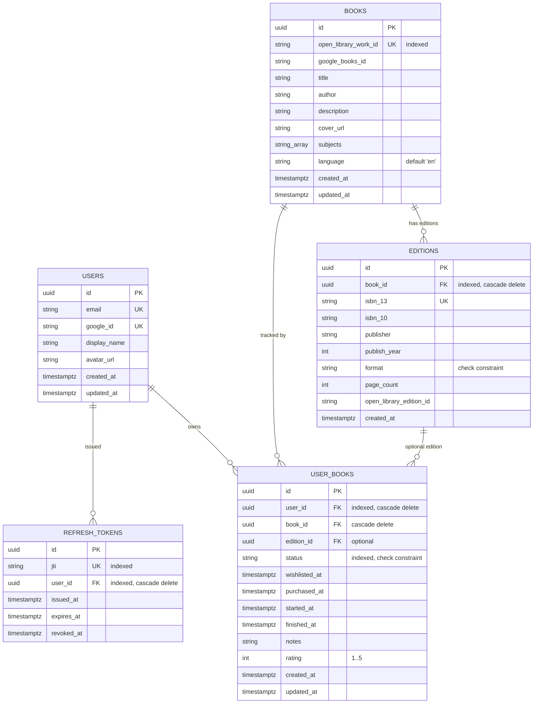

# Data model

PostgreSQL schema, entity reference, and the dedup strategy that makes the collection work at the work-level instead of per-edition. For the architectural rationale behind dedup see [`architecture.md`](architecture.md#adr-work-level-book-deduplication-open-library-work_id); for migration mechanics see the [Migration workflow](#migration-workflow) section below.

## ER diagram



All primary keys are `UUID` (Postgres native `uuid` type, generated server-side via `uuid.uuid4`). All timestamps are `TIMESTAMPTZ` (UTC). `ON DELETE CASCADE` is set on every FK except `user_books.edition_id` (which is nullable and intentionally does not cascade — deleting an edition leaves the `UserBook` with a dangling edition reference).

## Entity reference

### `users` (`backend/app/models/user.py`)

| Column | Type | Notes |
|---|---|---|
| `id` | UUID PK | generated |
| `email` | string, **unique**, not null | authenticated email |
| `google_id` | string, **unique**, not null | Google OAuth `sub` claim |
| `display_name` | string, nullable | from Google profile |
| `avatar_url` | string, nullable | from Google profile |
| `created_at` / `updated_at` | timestamptz, server defaults | `updated_at` auto-bumps on row change |

**Lockdown:** the backend enforces `ALLOWED_EMAILS` at the `/auth/google` endpoint — any Google account whose email isn't in that comma-separated env var is rejected *before* a User row is created. See [`architecture.md`](architecture.md#auth-architecture).

### `books` (`backend/app/models/book.py`)

Represents the **conceptual work** — the thing a user would say "I own Dune" about. Editions are separate.

| Column | Type | Notes |
|---|---|---|
| `id` | UUID PK | generated |
| `open_library_work_id` | string, **unique**, indexed, nullable | primary dedup key ([ADR](architecture.md#adr-work-level-book-deduplication-open-library-work_id)) |
| `google_books_id` | string, nullable | fallback dedup key when Open Library has no work_id |
| `title` | string, not null | |
| `author` | string, not null | first author; additional authors rolled into the string |
| `description` | string, nullable | from Open Library or Google Books |
| `cover_url` | string, nullable | Google Books cover URL (typically) |
| `subjects` | text[], nullable | Open Library subject tags |
| `language` | string, default `'en'`, not null | ISO 639-1 code |
| `created_at` / `updated_at` | timestamptz, server defaults | |

**Relationships:**
- `editions` → `Edition[]` (cascade delete — dropping a Book drops all its Editions)
- `user_books` → `UserBook[]` (cascade delete — dropping a Book drops all users' tracking rows)

### `editions` (`backend/app/models/edition.py`)

Specific publication of a Book. Captures ISBN, publisher, year, format.

| Column | Type | Notes |
|---|---|---|
| `id` | UUID PK | generated |
| `book_id` | UUID FK → `books.id`, indexed, cascade delete, not null | |
| `isbn_13` | string, **unique**, nullable | canonical identifier |
| `isbn_10` | string, nullable | legacy form |
| `publisher` | string, nullable | |
| `publish_year` | int, nullable | |
| `format` | string, nullable | check constraint: `hardcover`, `paperback`, `ebook`, `audiobook`, `unknown` |
| `page_count` | int, nullable | |
| `open_library_edition_id` | string, nullable | Open Library's per-edition ID |
| `created_at` | timestamptz, server default | no `updated_at` — editions are immutable once captured |

### `user_books` (`backend/app/models/user_book.py`)

The user's relationship to a Book — this is the "bookshelf" row.

| Column | Type | Notes |
|---|---|---|
| `id` | UUID PK | generated |
| `user_id` | UUID FK → `users.id`, indexed, cascade delete, not null | |
| `book_id` | UUID FK → `books.id`, cascade delete, not null | |
| `edition_id` | UUID FK → `editions.id`, nullable (no cascade) | nullable because wishlisted items often don't have an edition picked yet |
| `status` | string, indexed, not null | check constraint: `wishlisted`, `purchased`, `reading`, `read` |
| `wishlisted_at` | timestamptz, nullable | set when status first enters `wishlisted` |
| `purchased_at` | timestamptz, nullable | set on wishlisted→purchased transition |
| `started_at` | timestamptz, nullable | set on purchased→reading transition (or on re-read) |
| `finished_at` | timestamptz, nullable | set on reading→read transition |
| `notes` | string, nullable | user notes |
| `rating` | int, nullable | check constraint: 1..5 |
| `created_at` / `updated_at` | timestamptz, server defaults | |

**Uniqueness:** `(user_id, book_id)` is a unique constraint (`uq_user_books_user_book`). A user can have at most one tracking row per work — this is what dedup is enforcing. Different editions of the same work still share one `UserBook`; changing edition updates `edition_id` in place.

### `refresh_tokens` (`backend/app/models/refresh_token.py`)

Backs the refresh-rotation + revocation mechanism ([architecture.md](architecture.md#auth-architecture)).

| Column | Type | Notes |
|---|---|---|
| `id` | UUID PK | generated |
| `jti` | string, **unique**, indexed, not null | the `jti` claim inside the refresh JWT |
| `user_id` | UUID FK → `users.id`, indexed, cascade delete, not null | |
| `issued_at` | timestamptz, server default | |
| `expires_at` | timestamptz, not null | issued + `REFRESH_TOKEN_EXPIRY_DAYS` (default 7) |
| `revoked_at` | timestamptz, nullable | set on `/auth/refresh` (old jti) or `/auth/logout` |

**Lifecycle:** `/auth/refresh` validates the presented refresh JWT → checks `jti` exists and `revoked_at IS NULL` → issues a new access+refresh pair, inserts a new row, and sets `revoked_at = now()` on the old row. The effect is that **refresh tokens are single-use** — a stolen copy is invalidated by the legitimate client's next refresh.

## Dedup strategy — why work_id, not ISBN

The dedup check lives in `backend/app/services/deduplication.py` and runs inside the `POST /scan` response pipeline. For each candidate returned by the vision identifier + enrichment:

```python
# Pseudocode of DeduplicationService._is_in_library
if candidate.open_library_work_id:
    exists = db.exec(
        select(UserBook)
        .join(Book, Book.id == UserBook.book_id)
        .where(Book.open_library_work_id == candidate.open_library_work_id,
               UserBook.user_id == user_id)
    )
    if exists: return True  # already in library

if candidate.google_books_id:
    # same join on Book.google_books_id
    ...
```

**Why not ISBN:**
- A single work (*Dune*) has dozens of editions — hardcovers, paperbacks, international translations, special anniversary reprints, audiobooks, each with its own ISBN.
- ISBN-based dedup would let a user wishlist 14 copies of *Dune* and flag none of them as duplicates.
- Users think in terms of the **work** (*Dune*), not the **edition** (*Dune, 40th Anniversary Hardcover, Ace 2005*).

**Why the Google Books fallback:**
- Open Library doesn't always have a `work_id` (incomplete coverage on newer / self-published books).
- Google Books `volume_id` is still work-level (one per title+author), so it's a reasonable second choice.
- If neither is available, the candidate is returned with `already_in_library=False` and the user sees a duplicate — rare enough to accept.

**When dedup is actually applied:**
- On `POST /scan` the candidates are flagged (`already_in_library=true|false`) but still returned. The frontend's `BookCandidatePicker` shows the flag so the user can skip duplicates intentionally.
- On `POST /wishlist` the unique constraint `uq_user_books_user_book` on `(user_id, book_id)` is the database-level enforcement — the `Book` row is reused if dedup found a match, so the insert either succeeds (new tracking row) or fails the unique constraint (already tracking that Book).

## Migration workflow

Migrations are managed with Alembic and live in `backend/alembic/versions/`. Two migrations exist today:

- `0001_initial_schema.py` — creates `users`, `books`, `editions`, `user_books`
- `0002_refresh_tokens.py` — adds `refresh_tokens` table

### Writing a new migration

```bash
cd backend
source .venv/bin/activate

# Make your model change first (edit app/models/*.py)

# Autogenerate a migration skeleton
alembic revision --autogenerate -m "short description"

# Review the generated file — Alembic's autogen is imperfect
# (misses check constraints, reorders things, can generate no-ops)
$EDITOR alembic/versions/<new-file>.py

# Apply it
alembic upgrade head
```

### Check-constraint gotcha

Alembic autogen **does not detect `CheckConstraint` changes** well. When you modify or add a check constraint (e.g. a new status value, a different rating range), you typically need to:

1. Add an explicit `op.drop_constraint(...)` for the old one
2. Add an explicit `op.create_check_constraint(...)` for the new one

The existing `VALID_STATUSES` / `VALID_FORMATS` tuples in the model files are the source of truth — autogen will read them on future generations, but won't produce the drop+create dance for in-place edits.

### Rolling back

```bash
alembic downgrade -1           # one step back
alembic downgrade <revision>   # to a specific revision
alembic downgrade base         # nuke everything (dev only)
```

**Production caveat:** Render runs `alembic upgrade head` as `preDeployCommand` on every deploy (see `render.yaml`). A migration that fails there blocks the deploy. Test locally against a copy of the prod schema before merging migration PRs.

## Rules referenced

- Rule #7: SQLAlchemy ORM only — no raw SQL. The `_is_in_library` dedup check, the `/auth/refresh` jti lookup, and all CRUD paths use `select(...)` constructs, not text SQL.
