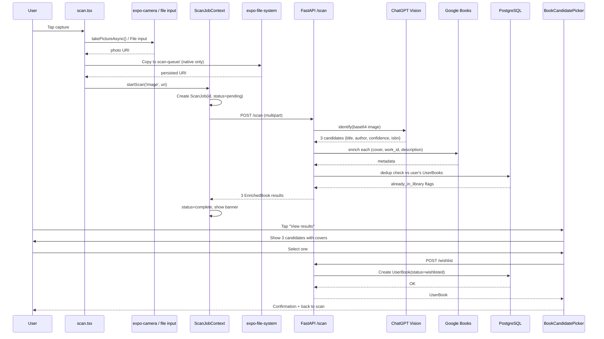

# Features

What the app does from a user's perspective, with flow diagrams. For the REST surface backing each feature see [`api.md`](api.md); for the data model see [`data-model.md`](data-model.md).

## Screens

Navigation is file-based via `expo-router`. Two route groups:

### `(auth)` — unauthenticated stack
- **`login.tsx`** — Google Sign-In. The only screen reachable before auth. Tapping the Google button opens the system OAuth flow; on success the app exchanges the Google ID token for a Bookshelf access + refresh pair.

### `(tabs)` — authenticated tab bar
- **Scan** (`scan.tsx`) — camera viewfinder (native) or file picker (web). Primary path into the app.
- **My Books** (`my-books.tsx`) — the user's full library with a status filter (All / Wishlisted / Purchased / Reading / Read). Tapping a book opens its detail modal for notes, rating, status transitions, or delete.
- **Wishlist** (`wishlist.tsx`) — filtered view showing only `wishlisted` entries. One-tap "I bought this" transitions to `purchased`.
- **Settings** (`settings.tsx`) — account info, language picker, theme toggle, sign-out.

## Core flows

### Scan flow — camera → identification → wishlist

This is the primary user flow. A photo becomes an EnrichedBook candidate, gets confirmed, and lands in the wishlist.



**Key implementation notes:**
- Images are persisted to `scan-queue/` (expo-file-system) on native so the job survives app backgrounding. Web doesn't persist — blob URLs die on navigation.
- `ScanJobContext.startScan()` is wrapped in try/catch with Sentry capture; any sync throw (like a crypto/uuid failure) becomes a handled banner, not a crash.
- Scan job IDs are minted with `Crypto.randomUUID()` from `expo-crypto` (native-backed, Hermes-safe — see the uuid regression in `frontend/.eslintrc.js`).
- Text search (`/books/search`) uses the same `ScanJob` pipeline with `type='text'` — different input path, same state machine.

### Auth flow — Google SSO → rotating refresh tokens

```mermaid
sequenceDiagram
  participant U as User
  participant L as login.tsx
  participant G as Google OAuth
  participant API as FastAPI /auth
  participant SS as SecureStore
  participant DB as refresh_tokens

  U->>L: Tap "Sign in with Google"
  L->>G: Open OAuth flow (platform-native)
  U->>G: Approve
  G-->>L: Google ID token (JWT)
  L->>API: POST /auth/google {id_token}
  API->>G: Verify token (JWKS, check aud ∈ configured client IDs)
  G-->>API: Valid
  API->>DB: Create/update User; insert RefreshToken(jti)
  API-->>L: {access_token, refresh_token}
  L->>SS: Store both (rule #6: SecureStore only, never AsyncStorage)
  L->>U: Navigate to (tabs)

  Note over U,API: ... 24 hours pass, access token expires ...

  U->>API: Any authenticated request
  API-->>U: 401 Unauthorized
  U->>API: POST /auth/refresh {refresh_token}
  API->>DB: Check jti exists + not revoked
  DB-->>API: Valid
  API->>DB: Mark old jti revoked; insert new jti
  API-->>U: {access_token, refresh_token} (new pair)
  U->>SS: Update stored tokens
```

**Key properties:**
- `verify_google_id_token()` accepts tokens whose `aud` is any of the three configured client IDs (web, iOS, Android) — one API serves all platforms.
- Refresh tokens are **single-use**: the old `jti` is revoked the instant a refresh happens. A stolen refresh token is invalidated by the legitimate client's next refresh.
- `ALLOWED_EMAILS` lockdown rejects any authenticated email not in the allowlist (single-user app by default).
- Token storage: `expo-secure-store` only, never `AsyncStorage` (rule #6).

## Reading-state transitions

A `UserBook` moves through four states. Transitions auto-timestamp the corresponding column (`wishlisted_at`, `purchased_at`, `started_at`, `finished_at`).

```
   wishlisted ─▶ purchased ─▶ reading ─▶ read
       │             │           │
       │             │           └─▶ reading (re-read, updates started_at)
       │             │
       │             └─▶ (no step back to wishlisted)
       │
       └─▶ dismiss (delete UserBook entirely)
```

Non-canonical transitions (e.g. skipping states, re-reads) are allowed — the frontend UI exposes the common paths, but the API accepts any state value on `PATCH /user-books/{id}`.

## Offline resilience

Scan jobs persist locally so the user can keep scanning even without connectivity. `ScanJobContext` is the single source of truth.

**Persistence:**
- Every change to the jobs list is saved to `expo-file-system` via `saveJobs()` (`lib/scanJobStorage.ts`).
- On app launch, `loadJobs()` restores the queue. Any job stuck in `searching` status (because the app was killed mid-scan) is reset to `pending`.

**Queue draining:**
- `NetInfo.addEventListener` watches for connectivity changes.
- When the app comes online, `drainQueue()` picks up any `queued` jobs and retries them, with a `QUEUE_DRAIN_DELAY` (2s) between each to avoid thundering the backend.
- `MAX_RETRIES` (3) caps how many times a single job auto-retries before it's parked in `queued` status for manual retry.

**Job state machine:**
```
pending ─▶ searching ─▶ complete
             │             │
             │             └─▶ (user confirms) ─▶ deleted
             │
             └─▶ failed ─▶ queued (manual)
                    │
                    └─▶ (user taps retry, if retries < 3) ─▶ pending
```

## i18n

**11 active locales** + 2 reserved for future RTL work.

| Code | Language | Status |
|---|---|---|
| `en` | English | Bundled statically (always in initial bundle) |
| `fr-CA` | French (Canadian) | Lazy |
| `es` | Spanish | Lazy |
| `hi` | Hindi | Lazy |
| `zh` | Chinese (Simplified) | Lazy |
| `ja` | Japanese | Lazy |
| `ko` | Korean | Lazy |
| `pt` | Portuguese | Lazy |
| `de` | German | Lazy |
| `nl` | Dutch | Lazy |
| `ru` | Russian | Lazy |
| `ar` | Arabic | Translations present, **disabled until RTL layout mirroring lands** |
| `he` | Hebrew | Translations present, **disabled until RTL layout mirroring lands** |

**Namespaces** (8): `common`, `auth`, `tabs`, `my-books`, `scan`, `settings`, `wishlist`, `components`. Each screen/context pulls only what it needs.

**Loading strategy:**
- `en` is a static import — always in the initial bundle, no flash-of-keys on first render, tests work without async setup.
- All other locales are lazy via `i18next-resources-to-backend` with static `import()` paths (Metro requires them static; see the explicit `importMap` in `src/i18n/i18n.ts`).
- Only the active locale's 8 namespaces are fetched at runtime — 80 of 88 JSON files stay deferred.

**Adding a string** (rule #9: every user-facing string must be translated):
1. Add the key to `src/i18n/locales/en/<namespace>.json`
2. Add the same key to the `_meta/<namespace>.meta.json` file with description + context
3. Translate into all 10 active non-en locales (or mark for translation and ship English fallback)
4. Use in component: `const { t } = useTranslation('<namespace>'); t('key')`

## Rules referenced

- Rule #5: No hardcoded colours — use `useTheme()` (settings screen has theme toggle)
- Rule #6: `SecureStore` only for tokens — never `AsyncStorage` (auth flow)
- Rule #9: i18n required on every user-facing string
